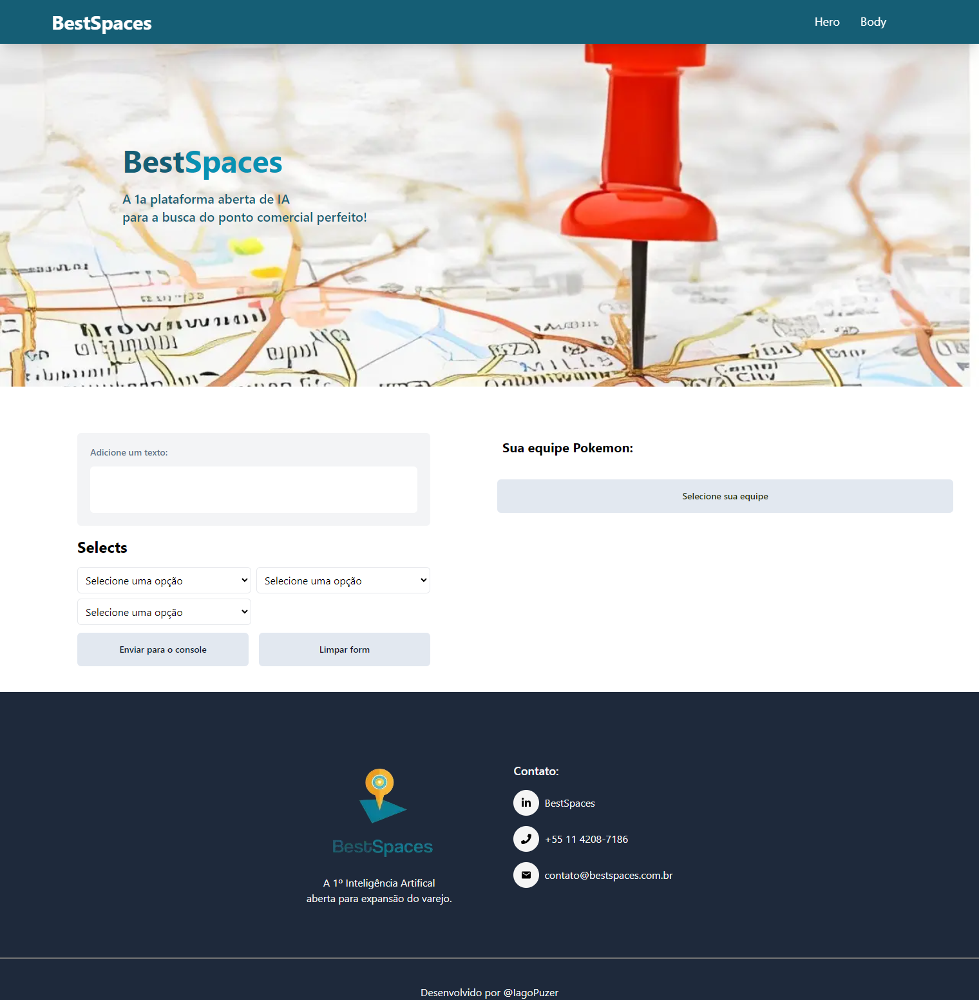

<h1 align="center"> Desafio Best Spaces <h1>


<h2>Descrição do projeto:<h2>
<p>Projeto desenvolvido para a realização do teste prático para vaga de Desenvolvedor Front-end da empresa Best Spaces.</p>

<p align="center">
 
</p>

## :hammer: Funcionalidades do projeto

- `Funcionalidade 1`:
    <p>Um form com um TextArea e 3 selects, onde podemos enviar o que foi digitado e o que foi selecionado para o console <p>

- `Funcionalidade 2`:
    <p>Um campo onde faz a pesquisa na PokeApi e retorna 3 Pokemons de forma aleátoria para o usuário.<p>

## :gear: Como rodar o projeto

**Pré-requisitos:**

- Node.js instalado

**Passos:**

1. Clone o repositório para a sua máquina:

   ```bash
   git clone git@github.com:IagoPuzer/BestSpaces.git

   ```

2. Acesse o diretório do projeto:

   ```bash
   cd nome-do-projeto
   ```

3. Instale as dependências:

   ```bash
   npm install
   ```

4.Execute o projeto:

    npm run dev

## 🛠️ Tecnologias utilizadas

- `NextJS` - version: 14.1.0
- `React` - version: 18
- `Tailwind CSS` - version: 3.3.0
- `NodeJS` - version: 20.3.1
- `npm` - version: 9.6.7
